# FrankenGPT: train a GPT-style language model locally

FrankenGPT is a compact decoder-only Transformer that you can train, resume, benchmark,
and sample on your own machine. This guide follows the complete workflow from a fresh
checkout to a verified model checkpoint and generated text.

This is an educational language model: it uses the same core learning objective and
decoder architecture as GPT, but it is intentionally small enough to inspect and train
locally. It is not a production-scale LLM or a route to ChatGPT-quality output on one
novel.

## What "from scratch" means

The scratch workflow does not download model weights or reuse a pretrained tokenizer.
FrankenGPT:

1. builds a vocabulary from the text you provide;
2. initializes every model weight randomly;
3. learns next-token prediction only from that corpus; and
4. saves checkpoints that are entirely the result of your training run.

The optional Hugging Face showcase later in the guide is deliberately labelled
**pretrained** and is not part of the from-scratch path.

## Learning path

Follow Steps 1–7 for the essential from-scratch journey: install the project, understand
the model, train it, verify learning, resume a checkpoint, generate text, and scale the
experiment. Steps 8–11 cover better data, benchmarking, validation, and the command
reference.

For the implementation behind each stage, read the
[from-scratch architecture walkthrough](docs/architecture.md). The maintained code lives
in `src/frankengpt`; `frankenlex_bootstrap.py` is a backward-compatible entry point for the
command-line app. The project runs on CPU and uses CUDA mixed precision automatically
when a CUDA PyTorch build is selected.

## Step 1 - Create an isolated Python environment

Use Python 3.10 or newer. Create and activate a virtual environment, then install the
project and its development tools.

```powershell
python -m venv .venv
.\.venv\Scripts\Activate.ps1
python -m pip install --upgrade pip
python -m pip install -e ".[dev]"
```

On macOS or Linux, activate the environment with `source .venv/bin/activate`; the
remaining commands are the same. The examples below use PowerShell's backtick for line
continuation. Other shells can run each example on one line.

The project uses the standard `pyproject.toml` editable-install workflow (PEP 660), so use
a current version of `pip` rather than invoking `setup.py` directly. A virtual environment
keeps the project dependencies separate from the system Python installation.

### Optional: enable NVIDIA GPU acceleration

The default Python package index may install a CPU-only PyTorch wheel even when the machine
has an NVIDIA GPU. Check the installed build:

```powershell
python -c "import torch; print(torch.__version__, torch.cuda.is_available())"
```

If this prints `False`, use the command generated by the official
[PyTorch installation selector](https://pytorch.org/get-started/locally/) for your operating
system and driver. For example, a current CUDA 13.0 installation uses:

```powershell
python -m pip install --force-reinstall torch `
  --index-url https://download.pytorch.org/whl/cu130
```

Run the check again and confirm that it prints a `+cu...` PyTorch version followed by
`True`. FrankenGPT's default `--device auto` will then select CUDA automatically. The
first smoke run below explicitly uses CPU so every reader can reproduce it; switch to
CUDA for the larger run in Step 7.

Confirm that the command-line application is available:

```powershell
frankengpt --help
```

## Step 2 - Understand what will be trained

The model learns next-token prediction. A sequence such as `The creature was` becomes an
input, and the desired target is the same sequence shifted by one token:

```text
input:   The creature was
target:      creature was ...
```

During training, the complete data flow is:

```mermaid
flowchart LR
    A["Corpus text"] --> B["Tokenizer and vocabulary"]
    B --> C["Shifted input/target windows"]
    C --> D["Token + position embeddings"]
    D --> E["Causal Transformer blocks"]
    E --> F["Next-token logits"]
    F --> G["Cross-entropy loss"]
    G --> H["AdamW weight update"]
    H --> I["Checkpoint"]
    I --> J["Autoregressive generation"]
```



The model is a GPT-style decoder with:

- learned token and positional embeddings
- masked multi-head self-attention, so a token cannot see future tokens
- pre-layer normalization, residual connections, GELU MLPs, and dropout
- tied input/output embeddings
- AdamW, warmup plus cosine learning-rate decay, gradient clipping, checkpoints, and
  CUDA mixed precision when CUDA is selected

See [How FrankenGPT works](docs/architecture.md) for tensor shapes, the causal mask,
attention calculations, residual blocks, loss, optimization, and sampling.

## Step 3 - Train a small model from scratch

Run this small CPU experiment first. `--download` obtains the Project Gutenberg
Frankenstein corpus when `data/pg84.txt` is not already present. The command uses a
word-level vocabulary so generated tokens are easy to inspect, plus a deliberately small
model so that the end-to-end check finishes quickly.

```powershell
frankengpt train --download --data data/pg84.txt --tokenizer word --max-vocab 2048 `
  --device cpu --output runs/readme-smoke --max-steps 10 --batch-size 8 `
  --context-length 16 --d-model 32 --n-heads 4 --n-layers 2 --eval-interval 5
```

For a larger character-level scratch run, use a new output directory and at least
`--max-steps 2000`. Small runs validate the pipeline; they do not produce coherent prose.

The output directory contains all artifacts from the run and is ignored by Git.

## Step 4 - Verify that training actually happened

The command prints JSON with model size, throughput, and loss history. A verified CPU run
produced the following result. Throughput varies by machine; the parameter count,
vocabulary size, and loss trend are the useful checks.

```text
{
  "device": "cpu",
  "parameters": 91520,
  "vocab_size": 2048,
  "tokens_per_second": 2014.8,
  "history": [
    {"step": 5.0, "train_loss": 7.6218, "val_loss": 7.6328, "lr": 0.00018},
    {"step": 10.0, "train_loss": 7.5856, "val_loss": 7.6039, "lr": 0.00030}
  ]
}
```

At this scale, use the loss history and checkpoints—not prose fluency—as the success
criteria.

Both the training loss and the held-out validation loss decreased. That is the first
evidence that optimization and validation are working. Throughput is machine-dependent;
the parameter count, vocabulary size, and loss history are the stable checks for this
configuration.

- `train_loss` measures prediction error on text used for weight updates.
- `val_loss` measures prediction error on held-out text that is not used for updates.
- lower loss is better; a widening train/validation gap is a warning sign for overfitting.

Inspect the files that were saved:

```powershell
Get-ChildItem runs/readme-smoke
Get-Content runs/readme-smoke/metrics.json
```

Expected files: `checkpoint_best.pt`, `checkpoint_last.pt`, and `metrics.json`.

## Step 5 - Resume from the saved checkpoint

Checkpoints contain the model, tokenizer, optimizer, scheduler, history, and current
step. Resume the same configuration with a larger `--max-steps` value:

```powershell
frankengpt train --data data/pg84.txt --tokenizer word --max-vocab 2048 `
  --device cpu --output runs/readme-smoke --resume runs/readme-smoke/checkpoint_last.pt `
  --max-steps 12 --batch-size 8 --context-length 16 --d-model 32 --n-heads 4 `
  --n-layers 2 --eval-interval 5
```

`metrics.json` should preserve the step 5 and step 10 records and add a new measurement
at step 12. Do not change model or tokenizer options when resuming a checkpoint.

## Step 6 - Generate text from the trained checkpoint

Load the best validation checkpoint and try different temperatures, top-k values, and
prompt lengths. Lower temperature and lower top-k make output more conservative; higher
values make it more varied.

```powershell
frankengpt generate --checkpoint runs/readme-smoke/checkpoint_best.pt --prompt "The" --max-new-tokens 24 --temperature 0.7 --top-k 10
frankengpt generate --checkpoint runs/readme-smoke/checkpoint_best.pt --prompt "I had worked hard" --max-new-tokens 24 --temperature 0.5 --top-k 5
frankengpt generate --checkpoint runs/readme-smoke/checkpoint_best.pt --prompt "I had worked hard for nearly two years" --max-new-tokens 24 --temperature 1.0 --top-k 30
```

One actual sample from the first command was:

```text
The earth interested does desires enemy affectionate desires disappeared figure figure
figure desires distinct noble.. the familiar valley valley safety disappeared disappeared
the
```

The text is intentionally not fluent after only ten updates. The successful outcome here
is that the model trained, selected the best checkpoint by validation loss, reloaded it,
and generated tokens from its learned vocabulary without an error.

## Step 7 - Train a larger scratch model

For a more meaningful single-book experiment, use the character tokenizer and train for
at least 2,000 steps. Use a new output directory so the small smoke checkpoint remains
available for comparison.

```powershell
frankengpt train --download --device cpu --max-steps 2000 --output runs/frankenstein-char
frankengpt generate --checkpoint runs/frankenstein-char/checkpoint_best.pt `
  --prompt "I had worked hard" --temperature 0.7 --top-k 10
```

If CUDA is available, replace `--device cpu` with `--device cuda`. CUDA automatically
enables mixed precision. Add `--compile` to opt in to `torch.compile` when it is supported
by your PyTorch installation. If the compiler backend is unavailable, FrankenGPT warns and
continues with eager execution on the selected device.

The repository also includes a verified 2,000-step CPU checkpoint. See the
[training report](docs/training_report.md) for its configuration, loss history, generation
assessment, and benchmark notes.

The default character model has about 0.8 million parameters. Calling it an LLM describes
the architecture and learning task, not its scale: coherent, general-purpose language
generation requires far more parameters, varied data, context, and compute.

## Step 8 - Improve the data for a better showcase

Training longer on a single book eventually overfits. Download several public-domain
books and start a new word-token run. Do not resume a Frankenstein-only checkpoint because
the vocabulary is different.

```powershell
frankengpt fetch-data --output-dir data/classics
frankengpt train --data data/classics/*.txt --tokenizer word --max-vocab 16384 `
  --device cuda --max-steps 10000 --batch-size 32 --output runs/classics-word
frankengpt generate --checkpoint runs/classics-word/checkpoint_best.pt `
  --prompt "I had worked hard for nearly two years" --temperature 0.6 --top-k 20
```

If CUDA is unavailable, change the training command to `--device cpu` and reduce the
batch size if memory is limited.

### Optional pretrained showcase

The scratch models demonstrate the architecture, but coherent prose requires much more
data and compute. For a polished local demo, fine-tune `distilgpt2` on the classics
collection. This is a separate pretrained-base workflow, not training from scratch.

```powershell
python -m pip install -e ".[showcase]"
frankengpt finetune-pretrained --data data/classics/*.txt --device cuda `
  --max-steps 200 --output runs/distilgpt2-classics
frankengpt generate-pretrained --checkpoint runs/distilgpt2-classics `
  --prompt "My dear Victor," --temperature 0.7 --top-k 30
```

Use `--device cpu` if CUDA is unavailable. The first run downloads the selected base model
from Hugging Face.

## Step 9 - Benchmark the checkpoint

Benchmark reports forward-pass throughput, generation throughput, and peak memory use.

```powershell
frankengpt benchmark --checkpoint runs/readme-smoke/checkpoint_best.pt --device cpu
```

Run the same command with `--device cuda` on a CUDA machine to measure GPU performance.

## Step 10 - Run the project checks

Before changing the model, run the lint checks and test suite:

```powershell
python -m ruff check .
python -m pytest
```

The tests cover tokenization, shifted dataset targets, Transformer forward passes, causal
attention masking, non-contiguous loss inputs, checkpoint loading, resumption safeguards,
and generation.

## Step 11 - Explore the available commands

The CLI contains these workflows:

| Command | Purpose |
| --- | --- |
| `frankengpt train` | Train from scratch or resume; write last/best checkpoints and metrics. |
| `frankengpt generate` | Generate from a scratch-model checkpoint. |
| `frankengpt benchmark` | Measure forward and autoregressive generation throughput. |
| `frankengpt fetch-data` | Download the curated public-domain classics collection. |
| `frankengpt finetune-pretrained` | Fine-tune a Hugging Face causal language model. |
| `frankengpt generate-pretrained` | Generate from the fine-tuned Hugging Face checkpoint. |

Append `--help` to any command to see its options and defaults. Only load `.pt` checkpoint
files you trust: PyTorch checkpoints can contain pickled Python data.

Use this sequence whenever you experiment: train, inspect the validation loss and saved
artifacts, resume if needed, generate with controlled sampling, and benchmark the result.

## Troubleshooting

- **`torch.cuda.is_available()` is `False`:** install a CUDA PyTorch wheel using the
  selector in Step 1; an NVIDIA driver alone is not enough.
- **The corpus is too short for a full batch:** reduce `--batch-size` or
  `--context-length`, or train on more text.
- **A checkpoint does not match the run:** resume with the same tokenizer and model
  options, changing only operational values such as `--max-steps`.
- **Generated text is incoherent:** first confirm that validation loss decreases, then
  increase the training budget and corpus. Ten steps only validate the pipeline.
- **`--compile` warns and falls back:** the compiler backend is unavailable; training
  continues safely in eager mode on the selected CPU or GPU.

## License

The repository is released under [CC0 1.0 Universal](LICENSE).
